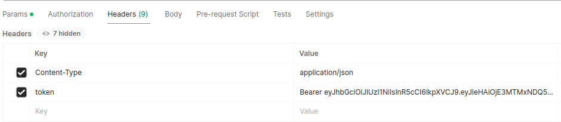
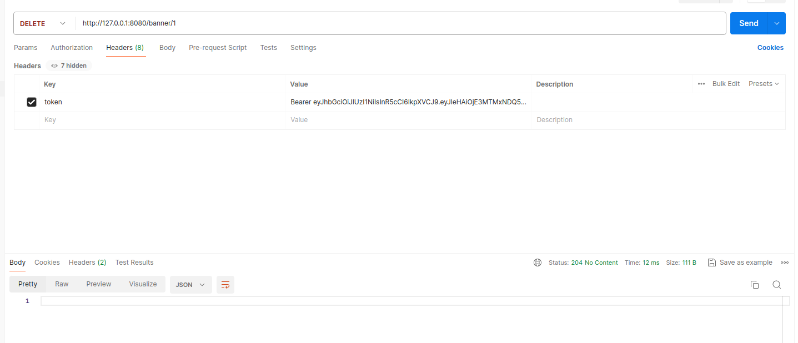

## Cервис позволяет показывать пользователям баннеры, в зависимости от требуемой фичи и тега пользователя, а также управлять баннерами и связанными с ними тегами и фичами.

## Инструкция по запуску

### Для запуска приложения:

```
make build && make run
```

## Регистрация и аутентификация

* Регистрация доступна по маршруту /sign-up

Пример входных данных для регистрации
```
{
    "username": "user",
    "password": "qwerty"
}
```

* Аутентификация доступна по маршруту /sign-in

    Для того чтобы выбрать роль пользователя или админа при аутентификации в json файле помимо username и password необходимо добавить ключ "role" и его значение "user" или "admin"

Пример входных данных для аутентификации
```
{
    "username": "user",
    "password": "qwerty",
    "role": "admin"
}
```

### Токен нужно использовать так, как показано на скриншоте ниже

**Bearer <ваш_токен>**



## Сервис баннеров

* POST /banner


* GET /user_banner


* PATCH /banner/{id}


**get banner after patch**


* GET /banner


* DELETE /banner

